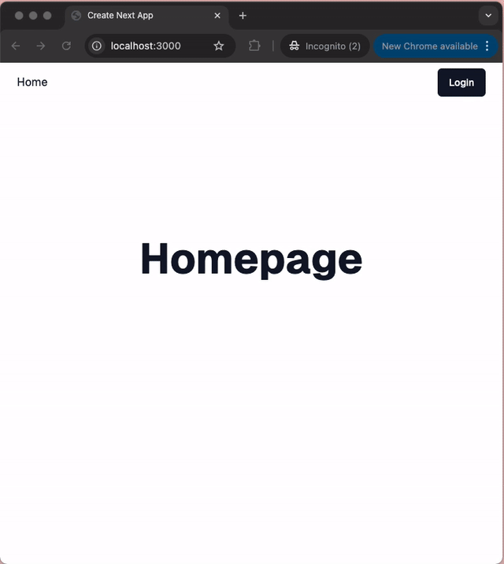

# Tech Stack

- [x] Next.js Typescript
- [x] Tailwind/Shadcn UI
- [x] ESLint
- [x] Local SQLite database, using Drizzle ORM

# Setup

1. `pnpm db:generate` - Generate migration files if needed
1. `pnpm db:migrate` - Run database migrations, DB should be in path `db/sqlite.db`
1. `pnpm db:seed` - Seed database
1. `pnpm dev` - Run Next.js app

# Credentials

- username: **username**
- password: **password**

# Functionalities

- [x] Homepage
  - [x] Nav Button, routes /login if not logged in, routes /dashboard if logged in
- [x] Dashboard
- [x] Login
  - [x] Sets cookie with successful login
  - [x] redirects to /dashboard with cookie
- [x] Auth with cookies, redirects to /login if not logged in, goes back to the protected route it came from
- [x] Logout, removes session
- [x] Username and password should persist with errors

# Followups:

- [ ] [Refresh/Updating tokens](https://nextjs.org/docs/app/building-your-application/authentication#updating-or-refreshing-sessions), tokens only last an hour
- [ ] Add [environment variables](https://nextjs.org/docs/app/building-your-application/configuring/environment-variables), like secrets and DB URL for sqlite
- [ ] Hash the user's password before storing it. Use bcrypt or crypto library
